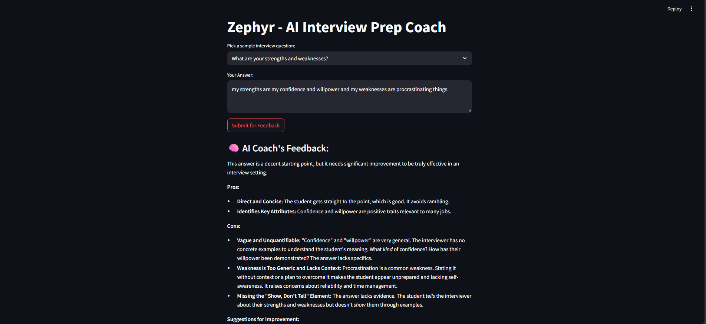

# Zephyr - AI Interview Coach

This is a Streamlit app that uses Google Gemini (Generative AI) to provide feedback on interview answers.

## Features

- Enter your interview answer and get instant AI-powered feedback.
- Uses Google Gemini API for natural language analysis.

## Screenshots


## Setup

1. Clone this repository.
2. Install dependencies:
   ```
   pip install -r requirements.txt
   ```
3. Create a `.env` file in the project root with your Gemini API key:
   ```
   GEMINI_API_KEY=your-gemini-api-key-here
   ```
4. Run the app:
   ```
   streamlit run app.py
   ```

## Notes

- **Never share your `.env` file or API keys publicly.**
- Free Gemini API usage is subject to Google’s quota limits.

---

Let me know if you want to customize these files further!
